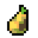

#  Pear Seed 

Pear Seed - это мод для King Arthur's Gold, приводящий в порядок (на субъективный взгляд автора) баланс ванильного CTF-режима игры. Является отдельной частью от мода Gruhsha CTF или проще говоря - одним из "семечек".

Главная цель мода - аккуратный ребаланс CTF-режима, сохраняя ванильную основу настолько, насколько это возможно и стараясь по возможности уничтожить имбалансые методы игры за тот или иной класс. Помимо ребаланса, содержит фиксы различных багов, которые так или иначе портят впечатление от игры в ванильный CTF.

## Установка
Создать папку pearseed в Mods (King Arthur's Gold/Mods), скопировать файлы из репозитория туда и в mods.cfg вписать название мода (pearseed).

## Авторы
- Skemonde - создатель Груши
- TerminalHash - основной майнтайнер мода

#### Программисты:
TerminalHash, kussakaa, egor0928931, Vagrament aka FeeRant, Skemonde

#### Художники:
TerminalHash, kussakaa, Skemonde

## Большое спасибо:
Bunnie - с её разрешения были взяты некоторые изменения из VanillaNoRequiem и EU Captains;
mehwaffle - некоторые изменения были взяты из US Captains.

